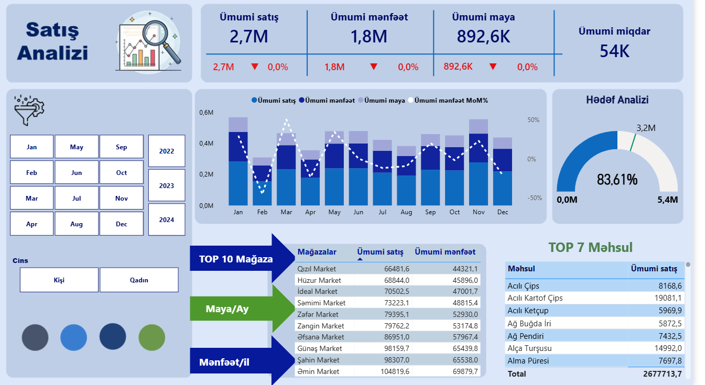
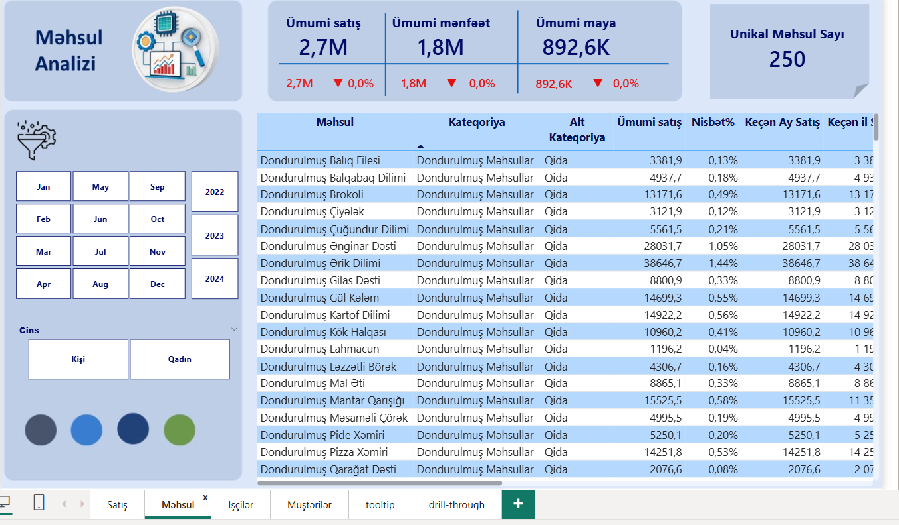
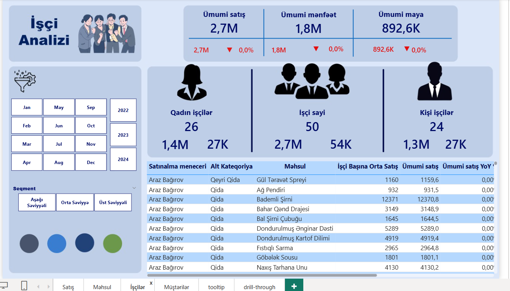
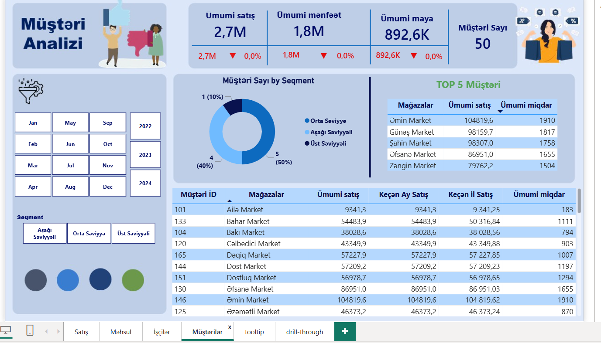

# Sales Analysis Dashboard (Power BI)

This project is an interactive sales analysis dashboard created in Power BI.

## Dashboard Features
- Sales overview with key KPIs
- Product analysis
- Customer analysis
- Employee performance analysis
- Monthly and yearly filtering
- Drill-through pages
- Tooltips
- Bookmarks
- Selection pane for navigation

## Tools Used
- Power BI
- Power Query
- DAX

## Data Preparation
The dataset was prepared and transformed using Power Query. Data cleaning, formatting, and modeling were completed directly in Power BI.

## Preview

### Sales Dashboard

### Product Analysis

### Employee Analysis

### Customer Analysis

## Project File

- Sales_Analysis.pbix
